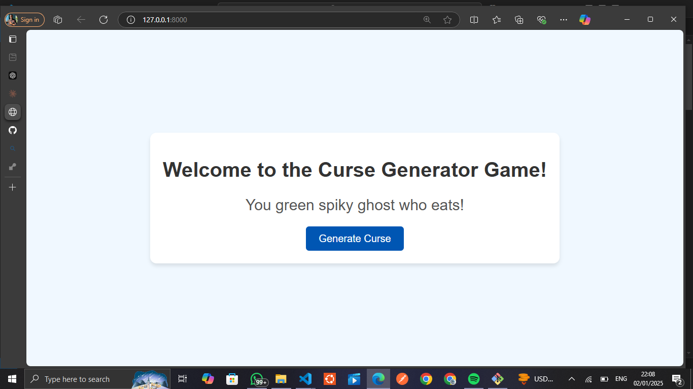
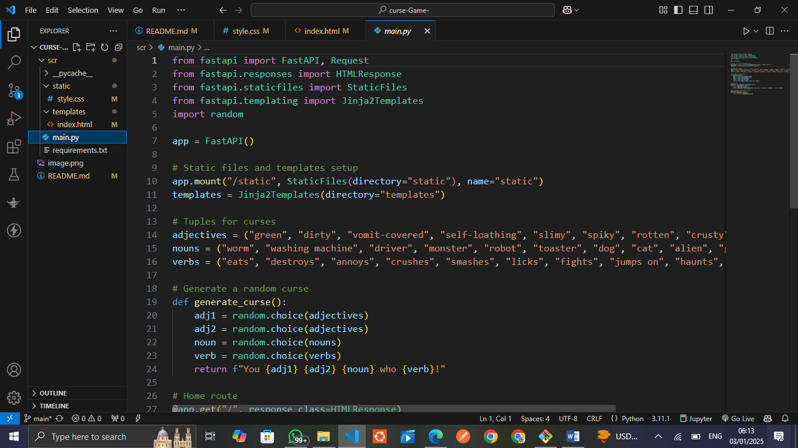

# Curses Game
## Screenshot


## Overview
The **Curses Game** is a web-based interactive game where players receive randomized funny or challenging curses (tasks) to perform. The game is designed to be engaging, fun, and simple to play, making it perfect for parties or casual online gatherings.

## How the Game Works
1. **Start the Game**: Open the game in a web browser.
2. **Generate a Curse**: Click the "Generate Curse" button to receive a random curse.
3. **Perform the Curse**: Players perform the curse as per the instructions.
4. **Repeat**: Players can generate new curses as many times as they like.

Each curse is designed to be humorous, lighthearted, and easy to understand.

## Features
- **Random Curse Generation**: A dynamic backend ensures every curse is unique.
- **Interactive User Interface**: A sleek and responsive UI for seamless gameplay.
- **Scalable Architecture**: Frontend and backend are decoupled for easy deployment and scaling.

## Technologies Used

### Frontend
- **HTML**: For structuring the web page.
- **CSS**: For styling the game interface.
- **JavaScript**: For making the game interactive and communicating with the backend.

### Backend
- **FastAPI**: A modern Python framework used to build the REST API for generating curses.
- **Python**: The programming language for implementing backend logic.

### Deployment
- **GitHub Pages**: For hosting the static frontend.
- **Render**: For hosting the FastAPI backend.

## How It Is Built

1. **Frontend Development**:
   - Designed the HTML structure for the game interface.
   - Styled the game with CSS to ensure responsiveness and modern design.
   - Implemented JavaScript to handle user interactions and communicate with the backend.

2. **Backend Development**:
   - Created a FastAPI application to handle API requests.
   - Developed an endpoint () that returns a random curse.
   - Used Python's random module to generate curses dynamically.

3. **Deployment**:
   - Deployed the frontend on GitHub Pages for easy access.
   - Deployed the backend on Render for scalability and reliability.

## How to Play
1. Clone the repository:
   ```bash
   git clone https://github.com/Victorasuquo/curse-Game-/blob/main/README.md
   ```
2. Open the `index.html` file in your browser or access the hosted version [here](https://curse-game-elect.onrender.com).
3. Click "Generate Curse" and enjoy!

## Development 


## Future Enhancements
- Add multiplayer functionality.
- Include customizable curse categories.
- Add a scoring system for competitive play.

---
**Made by**: Victor Asuquo

Feel free to raise issues or suggest improvements in the repository!


